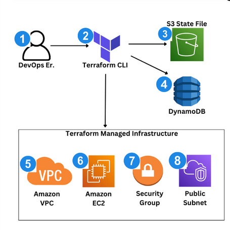
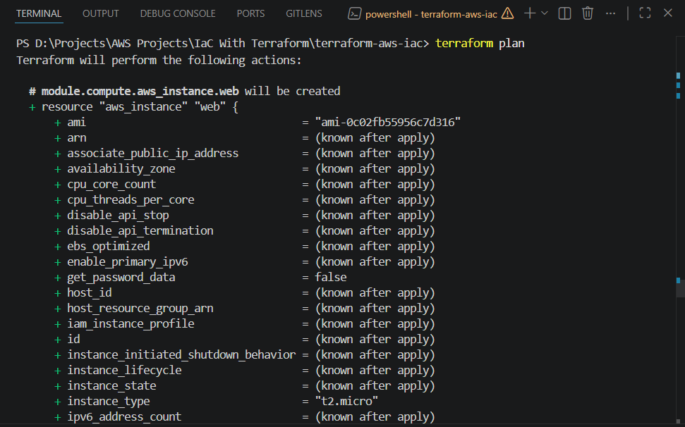
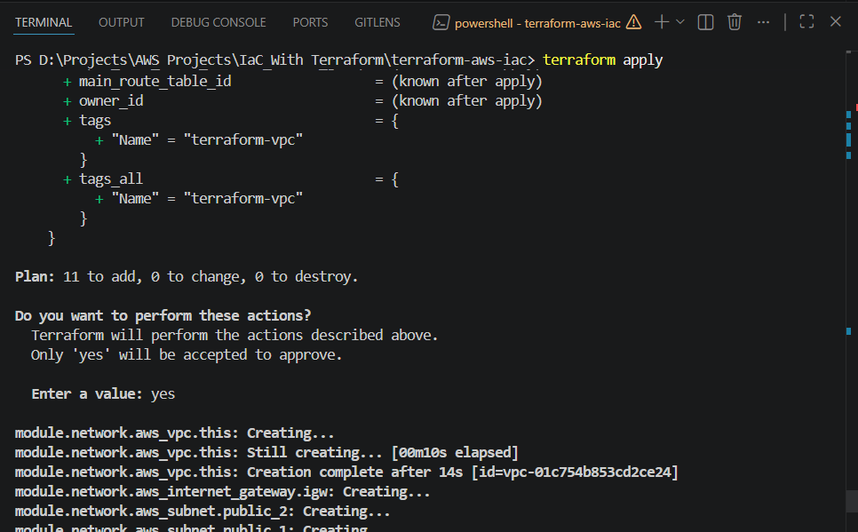
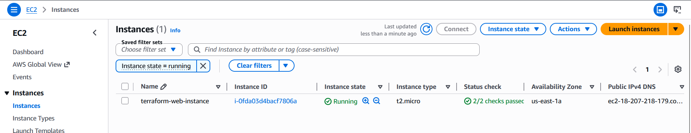
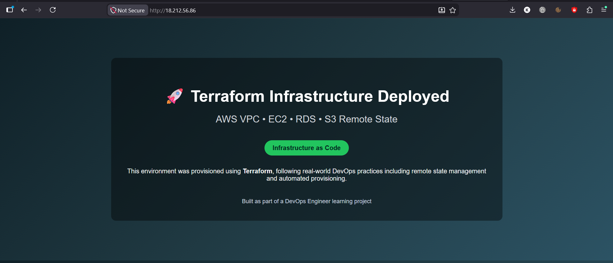

# Infrastructure as Code with Terraform

## Project Overview

A growing technology company manages its AWS infrastructure manually through the AWS Console. As the environment grows, this approach starts causing serious problems:
Infrastructure changes are undocumented, Environments drift over time, Reproducing setups across accounts is difficult, Rollbacks are risky and error-prone and Collaboration between engineers is inconsistent

The goal was to replace manual AWS Console operations with a repeatable, version-controlled, and automated deployment process. All infrastructure is defined in code, tracked through Terraform state, and organized using reusable modules.

The infrastructure includes networking, compute, database resources, remote state management, and modular Terraform architecture similar to what is used in production DevOps environments.

**Key Objectives:**

* Provision AWS infrastructure entirely using Terraform.
* Implement remote state management with locking.
* Build infrastructure incrementally using Infrastructure as Code.
* Refactor Terraform code into reusable modules.
* Follow industry-standard DevOps practices.

---

## Architecture




### Architecture Components

The deployed infrastructure consists of:

* Amazon VPC
* Public Subnets
* Internet Gateway
* Security Groups
* Amazon EC2 Instance hosting a web application
* Amazon S3 Backend for Terraform State
* Amazon DynamoDB State Locking Table

### Infrastructure Flow

1. Engineer runs terraform init, terraform plan, and
terraform apply.
2. Terraform initializes providers and configuration.
3. Terraform reads and writes state in Amazon S3.
4. Terraform uses DynamoDB to lock state during apply.
5. Terraform provisions the Amazon VPC.
6. Terraform creates the Amazon EC2 instance.
7. Terraform creates and attaches Security Groups.
8. Terraform deploys resources into a public subnet.

---

## Technologies Used

* AWS VPC
* AWS EC2
* AWS RDS (MySQL)
* AWS IAM
* AWS S3
* AWS DynamoDB
* Terraform
* Git
* GitHub
* AWS CLI

---

## Project Structure

```text
terraform-aws-iac/
│
├── main.tf
├── variables.tf
├── outputs.tf
├── .gitignore
│
└── modules/
    ├── network/
    │   ├── main.tf
    │   ├── variables.tf
    │   └── outputs.tf
    │
    ├── compute/
    │   ├── main.tf
    │   ├── variables.tf
    │   └── outputs.tf
    │
    └── database/
        ├── main.tf
        ├── variables.tf
        └── outputs.tf
```

### Module Responsibilities

| Module   | Purpose                                      |
| -------- | -------------------------------------------- |
| Network  | VPC, Subnets, Internet Gateway, Route Tables |
| Compute  | Security Groups and EC2 Instance             |
| Database | DB Subnet Group and RDS Instance             |

---

## Key Features

- **Infrastructure as Code** - All AWS resources are defined declaratively using Terraform configuration files.
- **Remote State Management** - Terraform state is stored remotely in Amazon S3 with state locking provided by DynamoDB.
- **Modular Design** - Infrastructure is separated into reusable modules; Network, Compute and Database Modules
- **Automated Dependency Management** - Terraform automatically determines resource creation order through resource references and dependency graphs.

### Repeatable Deployments

The entire environment can be recreated consistently using:

```bash
terraform init
terraform plan
terraform apply
```

### Safe Infrastructure Changes

Changes are reviewed before deployment using:

```bash
terraform plan
```

---

## Deployment Verification

### Terraform Plan



### Successful Terraform Apply



### AWS Resources Created



### Running Web Application



---

## Challenges Solved

- **Git and Terraform Best Practices** - Resolved issues related to accidentally committing Terraform provider binaries and implemented proper `.gitignore` configuration to prevent future repository bloat.
- **Terraform State Management** - Learned how Terraform tracks infrastructure using state files and why remote state is essential for team environments.
- **Remote Backend Configuration** - Configured Amazon S3 and DynamoDB to securely manage Terraform state and prevent concurrent infrastructure modifications.
- **Infrastructure Refactoring** - Refactored a monolithic Terraform configuration into reusable modules while preserving existing infrastructure.
- **State Migration** - Used Terraform state migration techniques to ensure resources were not recreated during module refactoring.

---

## What I Learned

Through this project I gained practical experience with:

* Infrastructure as Code principles
* Terraform workflows and lifecycle management
* AWS networking fundamentals
* VPC and subnet design
* Security Group configuration
* EC2 provisioning and automation using user data
* Amazon RDS deployment and configuration
* Remote Terraform state management
* DynamoDB state locking
* Terraform modules and reusable infrastructure design
* Terraform state migration and resource tracking
* Git and GitHub best practices for Infrastructure as Code projects

---

## Future Improvements

Potential enhancements for this project include:

* Private subnets and NAT Gateway implementation
* Application Load Balancer (ALB)
* Auto Scaling Groups
* Route 53 DNS integration
* HTTPS using AWS Certificate Manager
* CI/CD deployment pipeline using GitHub Actions
* Secrets management using AWS Secrets Manager
* Multi-environment deployments (Dev, Test, Production)

---

## Final Outcome

This project successfully demonstrates how to provision, manage, and organize AWS infrastructure using Terraform while following modern DevOps practices.

The final solution delivers:

* Reproducible infrastructure deployments
* Remote state management
* Modular Terraform architecture
* Automated infrastructure provisioning
* Production-style Infrastructure as Code workflows

---

## 🤝 Connect With Me

<p align="center">
<a href="mailto:knokwaku99@gmail.com">

</a>

<a href="https://www.linkedin.com/in/knosei/">

</a>
</p>

---
